# Task 2
## Демо и навигация

Приложение содержит 5 страниц, доступные через навигационное меню:

| Страница | Путь | Описание |
|----------|------|----------|
| Слайдер | `/slider` | Интерактивный слайдер изображений |
| Форма | `/form` | Форма с проверкой сложности пароля |
| Поиск | `/search` | Поиск и фильтрация списка |
| Конвертер | `/converter` | Конвертер валют с реальными курсами |
| Кнопка Up | `/button-up` | Кнопка прокрутки наверх |

##  Задания

### 1. Слайдер изображений (`/slider`)

### Столкнулся с проблемой с соединением, возможно у вас все заработает. Пробовал VPN и прокси
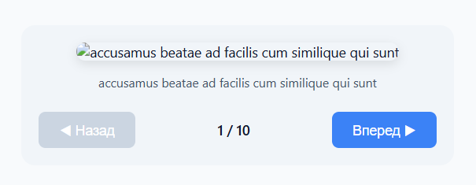
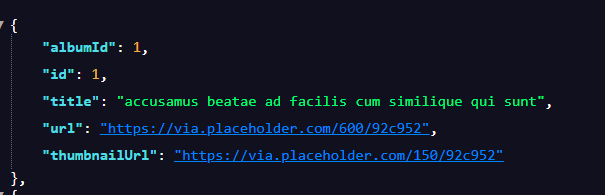
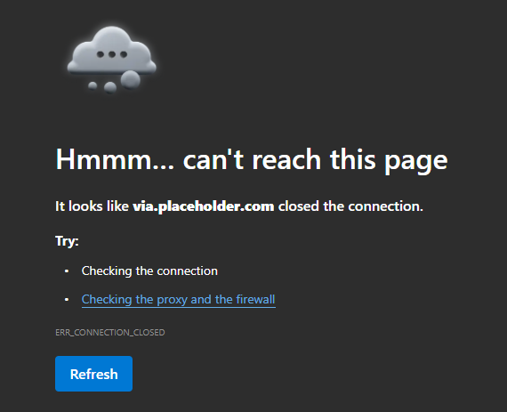

### Альтернативная реализация, изменен источник.

**Файлы реализации:**

- `shared/api/photosApi.js`
- `shared/api/axiosInstance.js`
- `widgets/SliderWidget/SliderWidget.jsx`
- `widgets/SliderWidget/SliderWidget.css`
- `pages/SliderPage/SliderPage.jsx`

### 2. Форма проверки пароля (`/form`)

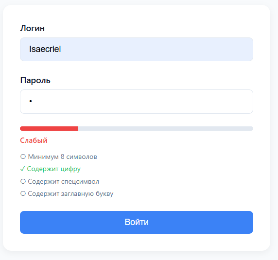
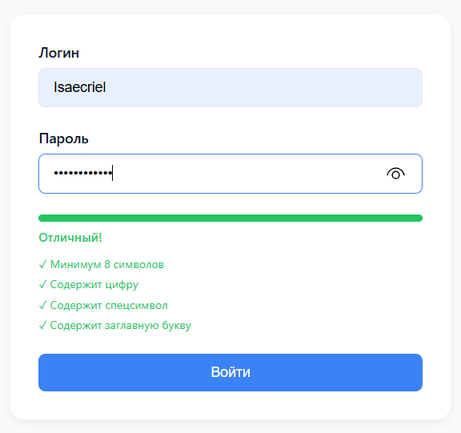

**Файлы реализации:**
- `widgets/FormWidget/FormWidget.jsx`
- `widgets/FormWidget/FormWidget.css`
- `pages/FormPage/FormPage.jsx`

### 3. Поиск и фильтрация (`/search`)

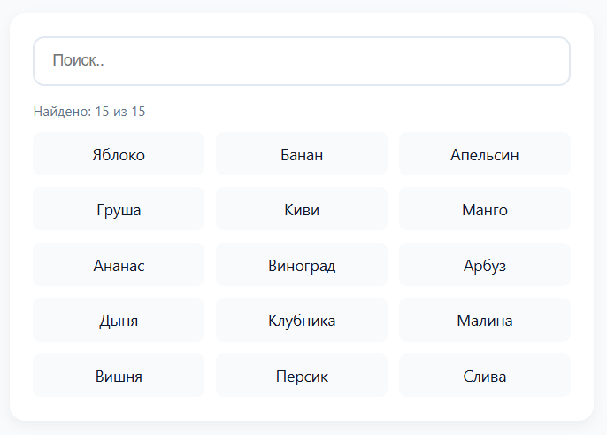
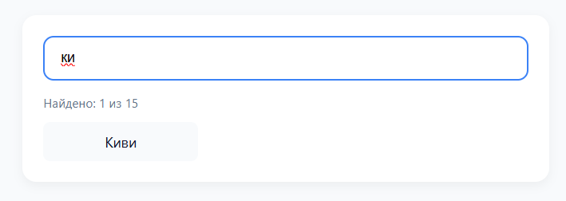

**Файлы реализации:**
- `widgets/SearchFilterWidget/SearchFilterWidget.jsx`
- `widgets/SearchFilterWidget/SearchFilterWidget.css`
- `pages/SearchFilterPage/SearchFilterPage.jsx`

### 4. Конвертер валют (`/converter`)

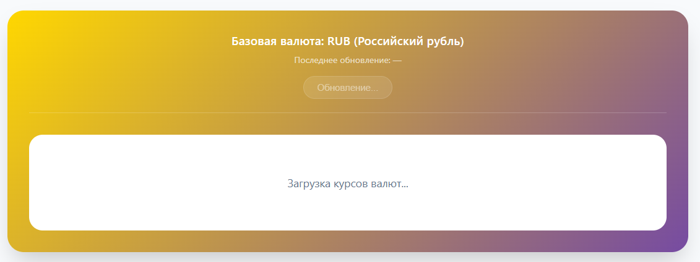
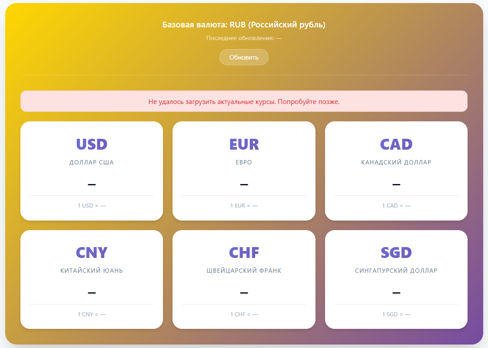
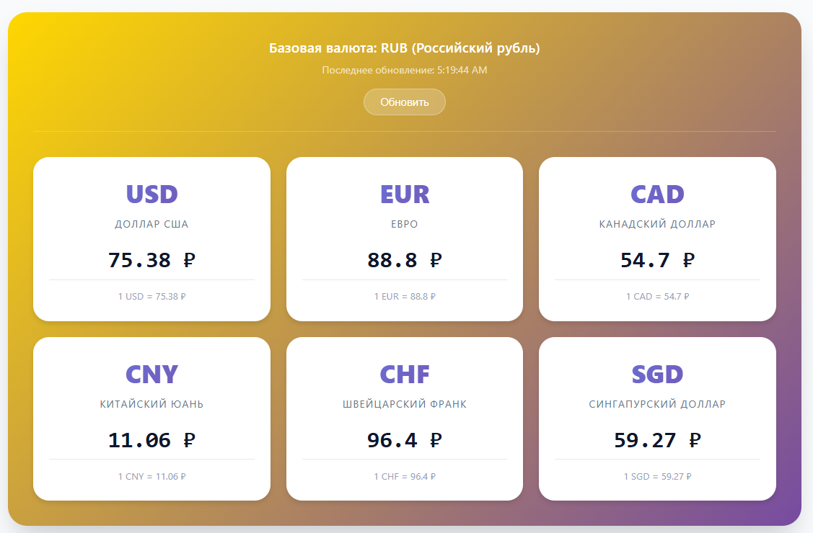

### Если есть карты типа Master или другие, Rapidapi подойдет в `shared/api/currencyApi.js` нужно будет изменить формат и вставить ваш ключ. В проекте использовался currencyapi как альтернатива.

### Примечание: у меня работало только с VPN

**Файлы реализации:**
- `shared/api/currencyApi.js`
- `widgets/ConverterWidget/ConverterWidget.jsx`
- `widgets/ConverterWidget/ConverterWidget.css`
- `pages/ConverterPage/ConverterPage.jsx`

### 5. Кнопка «Наверх» (`/button-up`)

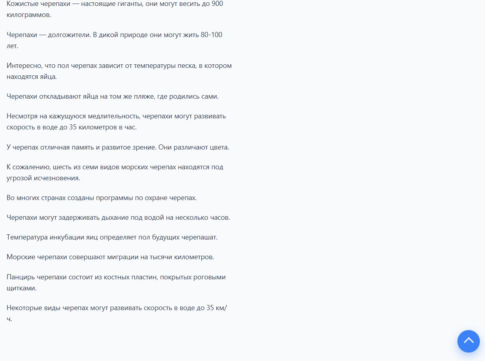

**Файлы реализации:**
- `widgets/ButtonUpWidget/ButtonUpWidget.jsx`
- `widgets/ButtonUpWidget/ButtonUpWidget.css`
- `pages/ButtonUpPage/ButtonUpPage.jsx`

## Установка и запуск

```bash
# Установка зависимостей
npm install

# Запуск dev-сервера
npm run dev

# Сборка проекта
npm run build

# Предпросмотр сборки
npm run preview